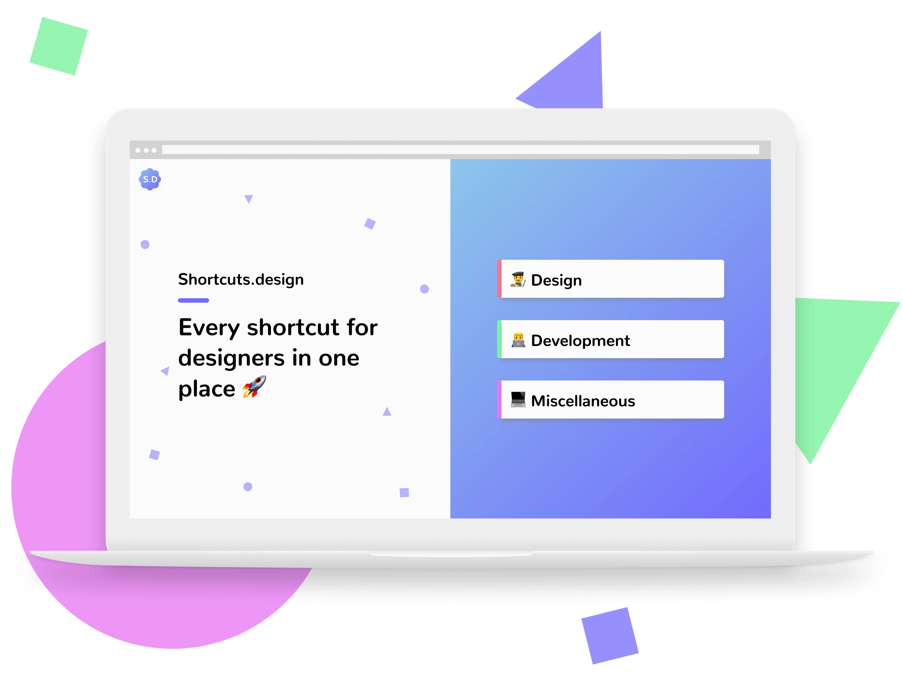

<h1 align="center">
   
  Shortcuts.design 
  

    
  

</h1>

Every shortcut for designers in one place

 
 

  

 

## Introduction

Hi all, I'm [Michel](https://twitter.com/michelvanheest) and I'm a Interaction and UX design student. In November 2017, I launched [Shortcuts.design](http://shortcuts.design/).

Shortcuts.design is a small website that lists every shortcut a designer ever wants to know, all designapps in one place and in a simple and clear way. It's very usefull for beginning designers to quickly charge their workflow, when you switched to a new designtool or when you just want a reference to see which shortcut to use for that action you have to do all day long.

## Contributing

### Using GitHub
In case you don't know how to contribute using GitHub, please check out [this short post](https://gist.github.com/MarcDiethelm/7303312) by [Marc Diethelm](https://gist.github.com/MarcDiethelm).

### Bugs, feature requests and shortcuts-mistakes
Please use GitHub issues to report any bugs and file feature requests. If you can fix it yourself, please fix it and send in a pull request.

### Adding or changing shortcuts
Do you want to add or change shortcuts? Please go ahead and do it yourself and send in a pull request.

### Pull requests
Pull requests should include information about what has been changed. All pull requests will be reviewed by Michel.

## Requesting

### Requesting new applications
Send us the names of the tools you want to see featured in a next release by filling out this [Google Form](https://docs.google.com/forms/d/e/1FAIpQLScDUjlisbnqEK5iEwMRoNacf_CvuN0JCLLIlhAxSOKgt7Db2A/viewform) or use GitHub issues.

## Links
- [Shortcuts.design](http://shortcuts.design/)
- [Twitter](https://twitter.com/michelvanheest)
- [Google Form](https://docs.google.com/forms/d/e/1FAIpQLScDUjlisbnqEK5iEwMRoNacf_CvuN0JCLLIlhAxSOKgt7Db2A/viewform)
