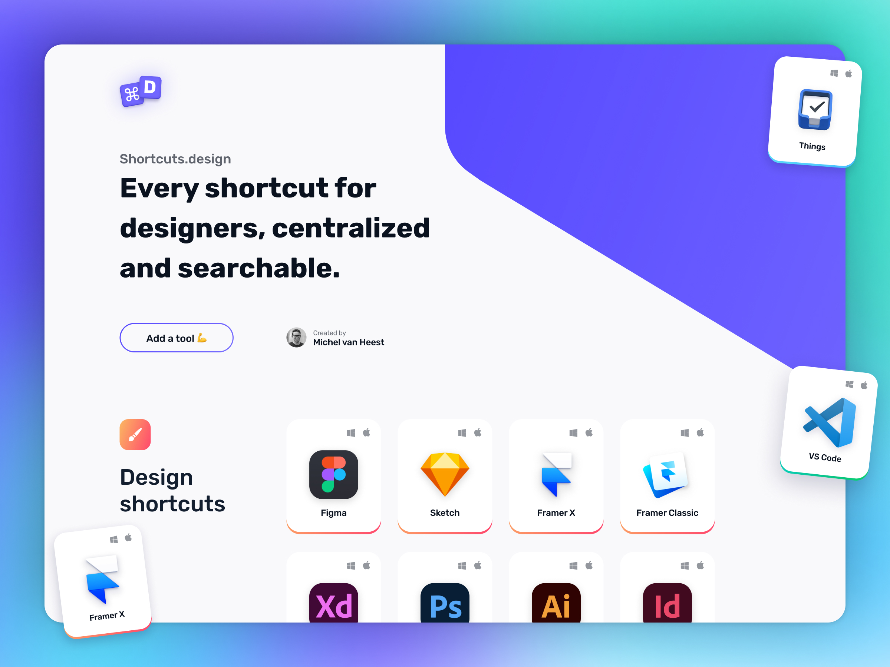

<h1 align="center">
  Shortcuts.design — Every shortcuts for designers, centralized and searchable.<br>
  <p align="center">
	  <a href="https://stats.uptimerobot.com/kXWkYTnGQn">
	    
	    <a href="https://app.netlify.com/sites/agitated-poincare-681d60/deploys">
	    
	  </a>
	  <a href="https://twitter.com/michelvanheest">
	    
	  </a>
  </p>
</h1>




## Introduction
Hi, I'm [Michel](https://www.michelvanheest.com), the creator of [Shortcuts.design](https://shortcuts.design). Shortcuts.design lists every shortcut for designers in one place and in a simple and clear way. It's a centralized and searchable online database that helps over 10K designers every month to quickly charge their workflow. Whether you're a beginning designer looking to work more efficient, when you switched to a new designtool or when you just want a reference to see which shortcut to use for that action you have to do all day long, it'll help you get there.

## Contributing
Please use [GitHub issues](https://github.com/michelvanheest/shortcuts-design-data/issues/new) to report any bugs or feature requests. If you can fix it yourself, please fix it and send in a pull request.

**Note:** all data is in plain HTML, we're working on that 😅

### Running the project
Shortcuts.design runs on [Eleventy](eleventy is a simpler static site generator.). Use the following commands to get started:

- Install: `npm install`
- Build: `npx @11ty/eleventy`
- Run: `npx @11ty/eleventy --serve`

### Changing data
Edit the data of a specific tool in *data/{category}/{toolpages-toolname.html}*.

### Adding tools
1. Add a new file to */tools*, for example `toolspage-{tool-name-here}.md` with the following data:

	```
	---
	layout: layouts/tool.njk
	tool: {tool-name-here}
	os1: Mac {leave empty if only Mac or Windows}
	os2: Windows {leave empty if only Mac or Windows}
	toolSlug: {tool-name-with-dashes}
	toolGroup: {pick from *Design*, *Development* or *Productivity*}
	toolDescription: {write a description about the tool here}
	toolLink: {link to the tool here}
	toolLinkDescription: {how the link should be displayed}
	---
	```
2. Add a logo to *assets/img* with the following naming-convention: `logo-{toolslug-here}.png`, logo's should be 264*264px.
3. Add the data to *data/{category}/*. Use the formating instructions below. For quick generation of the needed HTML, use the following file:
	- <a href="https://github.com/michelvanheest/shortcuts-design-data/docs/Shortcuts.design-data-creator.xlsx">MS Excel</a>
	- <a href="https://github.com/michelvanheest/shortcuts-design-data/docs/Shortcuts.design-data-creator.xlsx">Apple Numbers</a>

### Symbols

Please keep the code/data clean and consistent by using the following symbols when adding shortcuts on Mac tools-pages:

| Key | Symbol |
|---|---|
| Control | ⌃ |
| Option / Alt | ⌥ |
| Command | ⌘ |
| Shift | ⇧ |
| Enter | ↩ |
| Arrow keys | ↑ ↓ ← → |


### Using GitHub
In case you don't know how to contribute using GitHub, please check out [this short post](https://gist.github.com/MarcDiethelm/7303312).


## About the designer / developer
Hi, I'm [Michel](https://twitter.com/michelvanheest), I created Shortcuts.design to help others charge their workflow. I'm a Product Designer on a mission to build products for others that enable them to become more productive and effective · Product Design <a href="https://yipyip.nl?ref=shortcuts.design" target="_blank">@YipYip</a> · Prev <a href="https://about.wetransfer.com/en/?ref=shortcuts.design" target="_blank">@WeTransfer</a> &amp; <a href="https://awkward.co?ref=shortcuts.design" target="_blank">@Awkward</a>.

## Links
- [Shortcuts.design website](http://shortcuts.design/)
- [Personal website - Michel van Heest](https://www.michelvanheest.com)
- [Twitter - Michel van Heest](https://twitter.com/michelvanheest)
